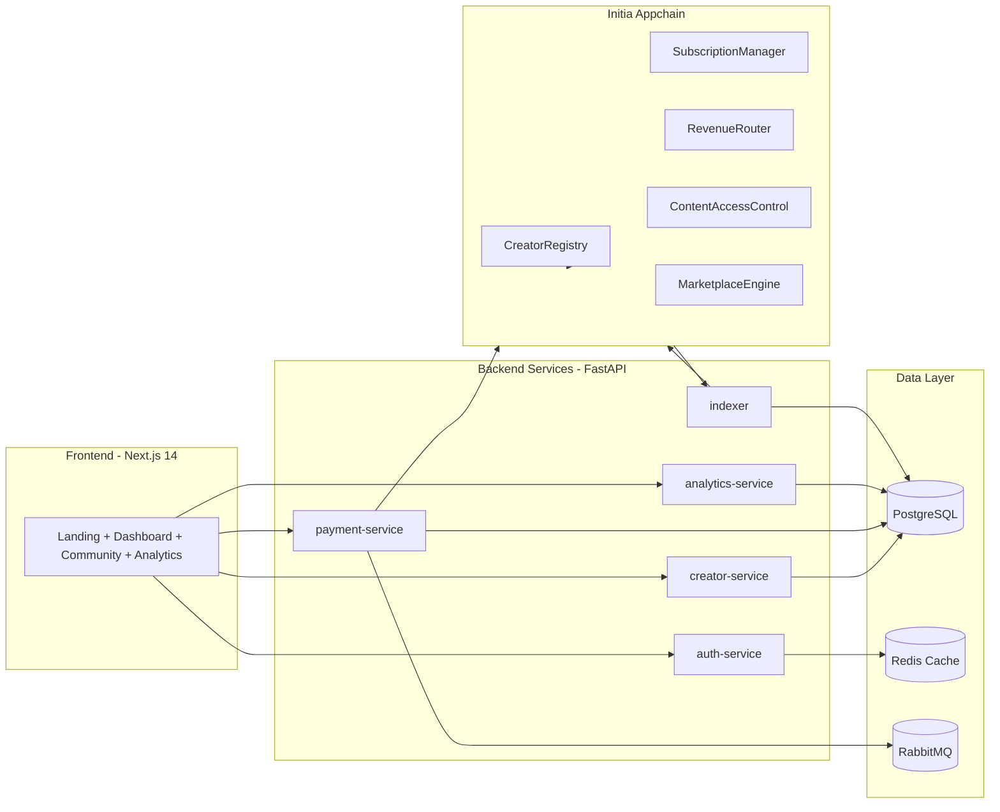

# CreatorChain Architecture

## System Diagram

## Key Flows
- Creator onboarding: UI -> auth-service -> creator-service -> CreatorRegistry
- Subscription: UI -> payment-service -> SubscriptionManager -> RevenueRouter
- Analytics: indexer writes chain events to Postgres -> analytics-service queries

